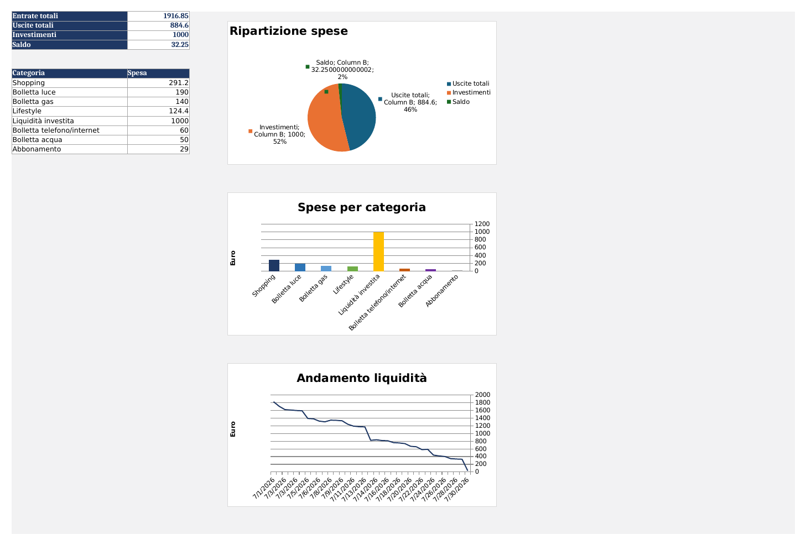
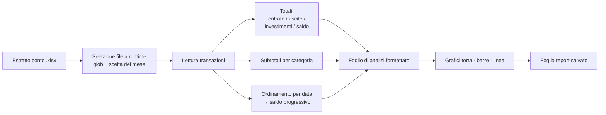

# Analizzatore di Estratti Conto Mensili

**Trasforma l'export Excel grezzo di un estratto conto in un report mensile formattato — totali, ripartizione delle spese per categoria e andamento della liquidità — in una sola esecuzione, senza lavoro manuale sul foglio di calcolo.**

Nato per sostituire un'attività manuale ricorrente: invece di ricostruire ogni mese le stesse tabelle pivot e gli stessi grafici a mano, lo script legge l'estratto conto grezzo e produce un foglio di report pulito e pronto da condividere.



---

## Cosa fa

- Legge un estratto conto `.xlsx` (data, importo, categoria, merchant) e **rileva automaticamente ogni estratto conto presente nella cartella**, lasciando scegliere all'utente quale mese analizzare al momento dell'esecuzione.
- Calcola **entrate, uscite, investimenti e saldo finale**, tenendo separati i soldi spostati verso conti di investimento dalle spese reali, così la cifra "spesa" non risulta gonfiata.
- Scompone le uscite **per categoria** e genera tre grafici: ripartizione (torta), spesa per categoria (barre colorate) e **andamento della liquidità nel tempo** (linea) (le categorie sono state scelte arbitrariamente)
- Scrive tutto in un foglio di analisi dedicato e formattato in modo professionale — e lo **rigenera al suo posto** a ogni riesecuzione, invece di accumulare doppioni.

**Stato:** strumento funzionante, sviluppato attivamente mentre lo estendo verso esecuzioni automatiche/pianificate.

---

## Come funziona



Tutto gira su un'unica libreria (`openpyxl`): nessuna dipendenza pesante e un output in `.xlsx` nativo, apribile da chiunque nel team senza strumenti aggiuntivi.

---

## Stack tecnologico

| Scelta | Perché |
|---|---|
| **Python** | Leggibile, nessuna compilazione, portabile tra le macchine Windows/Mac del team. |
| **openpyxl** | Legge e scrive `.xlsx` nativi, grafici e stile delle celle inclusi — l'output resta un vero file Excel, non un'immagine o un PDF. |
| **Aggregazione con dizionari** | Raggruppa le spese per categoria in un'unica passata — il pattern del `SUMIF`, in codice. |
| **Selezione file a runtime** (`glob` + `input`) | Slega la logica dal singolo mese, così lo stesso script serve ogni estratto conto. |

---

## Accortezze

**1. Saldo progressivo corrotto da righe fuori ordine.**
Il grafico della liquidità mostrava crolli verticali a zero inesistenti nei dati. Causa: le transazioni non erano ordinate per data di esecuzione e questo causava "crolli" nel grafico. Soluzione: **ordinare le transazioni per data prima di accumulare.**

**Prima**


**Dopo**


**2. Investimenti separati dalle spese.**
I soldi trasferiti su un conto di investimento sono un importo negativo, ma trattarli come spesa sovrastima le uscite e sottostima il patrimonio. Il parser **classifica `Liquidità investita` a parte**, così il report distingue tra "speso" e "spostato".

**3. Generazione del report idempotente.**
Prima ogni riesecuzione aggiungeva un nuovo foglio di analisi. Ora lo script **rileva il foglio esistente e lo rigenera**, così il report è sicuro da lanciare ripetutamente — presupposto necessario per poterlo un domani pianificare.

---

## Come si esegue

```bash
pip install openpyxl
python analisi_spese_mensili.py
```

Sono inclusi due estratti conto di test pronti all'uso

---

**Autore:** Gabriele Giudici

*Ultimo aggiornamento: luglio 2026*
