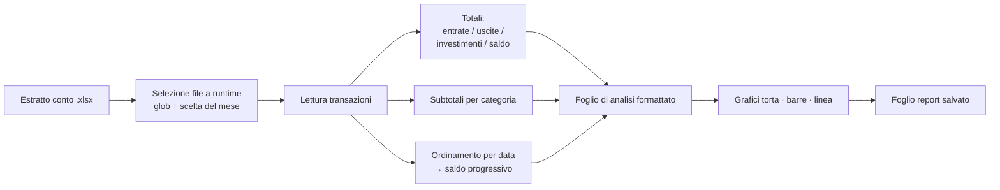

# Analizzatore di Estratti Conto Mensili

**Trasforma l'export Excel grezzo di un estratto conto in un report finanziario mensile formattato — totali, ripartizione delle spese per categoria e andamento della liquidità — in una sola esecuzione, senza lavoro manuale sul foglio di calcolo.**

Nato per sostituire un'attività manuale ricorrente in un flusso di lavoro finance/operations: invece di ricostruire ogni mese le stesse tabelle pivot e gli stessi grafici a mano, lo script legge l'estratto conto grezzo e produce un foglio di report pulito e pronto da condividere.


---

## Cosa fa

- Legge un estratto conto `.xlsx` (data, importo, categoria, merchant) e **rileva automaticamente ogni estratto conto presente nella cartella**, lasciando scegliere all'utente quale mese analizzare al momento dell'esecuzione.
- Calcola **entrate, uscite, investimenti e saldo finale**, tenendo separati i soldi spostati verso conti di investimento dalle spese reali, così la cifra "spesa" non risulta gonfiata.
- Scompone le uscite **per categoria** e genera tre grafici: ripartizione (torta), spesa per categoria (barre colorate) e **andamento della liquidità nel tempo** (linea).
- Scrive tutto in un foglio di analisi dedicato e formattato in modo professionale — e lo **rigenera al suo posto** a ogni riesecuzione, invece di accumulare doppioni.

**Stato:** strumento funzionante, sviluppato attivamente mentre lo estendo verso esecuzioni automatiche/pianificate.

---

## Come funziona



Tutto gira su un'unica libreria (`openpyxl`): nessuna dipendenza pesante e un output in `.xlsx` nativo, apribile da chiunque nel team senza strumenti aggiuntivi.

---

## Stack tecnologico

| Scelta | Perché |
|---|---|
| **Python** | Leggibile, nessuna compilazione, portabile tra le macchine Windows/Mac del team. |
| **openpyxl** | Legge e scrive `.xlsx` nativi, grafici e stile delle celle inclusi — l'output resta un vero file Excel, non un'immagine o un PDF. |
| **Aggregazione con dizionari** | Raggruppa le spese per categoria in un'unica passata — il pattern del `SUMIF`, in codice. |
| **Selezione file a runtime** (`glob` + `input`) | Slega la logica dal singolo mese, così lo stesso script serve ogni estratto conto. |

---

## Problemi tecnici risolti

Le parti interessanti non erano i grafici, ma i bug di integrità dei dati che emergono solo su estratti conto reali e disordinati.

**1. Saldo progressivo corrotto da righe fuori ordine.**
Il grafico della liquidità mostrava crolli verticali a zero inesistenti nei dati. Causa: alcune transazioni erano in fondo al foglio ma datate a inizio mese. Poiché un saldo progressivo **dipende dall'ordine**, accumulare nell'ordine delle righe assegnava a quelle transazioni valori privi di senso, e il grafico disegnava una linea che tornava indietro alle prime date con importi quasi a zero. Soluzione: **ordinare le transazioni per data prima di accumulare.** Lezione: con i valori cumulativi, l'ordine dei dati fa parte della correttezza, non è un dettaglio estetico.

**2. Dati del grafico disallineati da una collisione intestazione/dati.**
Al grafico a barre mancava la prima categoria ed era sfalsato di una posizione. L'intestazione della tabella e la prima riga di dati venivano scritte sulla stessa riga: l'intestazione veniva sovrascritta e ogni riferimento dei grafici finiva spostato di uno. Soluzione: **separazione netta — intestazione su una riga, dati dalla riga successiva**, con i range dei grafici ancorati a ciascuna. Lezione: un errore di off-by-one nei range produce un grafico che si disegna pulito ed è silenziosamente sbagliato; la garanzia è allineare ogni riferimento a un layout di tabella esplicito.

**3. Investimenti contati due volte come spese.**
I soldi trasferiti su un conto di investimento sono un importo negativo, ma trattarli come spesa sovrastima le uscite e sottostima il patrimonio. Il parser **classifica `Liquidità investita` a parte**, così il report distingue tra "speso" e "spostato".

**4. Generazione del report idempotente.**
Prima ogni riesecuzione aggiungeva un nuovo foglio di analisi. Ora lo script **rileva il foglio esistente e lo rigenera**, così il report è sicuro da lanciare ripetutamente — presupposto necessario per poterlo un domani pianificare.

---

## Come si esegue

```bash
pip install openpyxl
python analisi_spese_mensili.py
```

Metti uno o più estratti conto (es. `spese_giugno_2026.xlsx`) nella stessa cartella; lo script li elenca e chiede quale analizzare, poi scrive il report in un nuovo foglio dello stesso file.

È incluso un estratto conto di test pronto all'uso: ha entrate note (5.789 €), resta sempre positivo e contiene di proposito righe fuori ordine, così la correzione sull'ordinamento per data è verificabile end to end.

---

## Cosa dimostra questo progetto

- Trasformare un'attività aziendale reale e ripetitiva in un flusso automatizzato e affidabile.
- Il debug di problemi di **correttezza dei dati** (dipendenza dall'ordine, riferimenti off-by-one, classificazione) — non solo far girare il codice, ma rendere il suo output affidabile.
- Scrivere codice pensato per essere **rieseguito e condiviso** con colleghi non tecnici: idempotente, a dipendenza singola, con output nativo.

---

**Autore:** [nome-cognome] — [github.com/tuo-username](https://github.com/tuo-username)

*Ultimo aggiornamento: luglio 2026*
