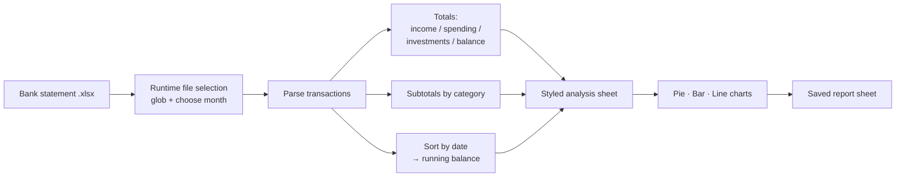

# Monthly Bank Statement Analyzer

**Turns a raw bank-statement Excel export into a formatted monthly financial report — totals, spending breakdown by category, and a liquidity trend — in one run, with zero manual spreadsheet work.**

Built to replace a recurring manual task in a personal finance workflow: instead of hand-building the same pivot tables and charts every month, the script reads the raw statement and produces a clean, ready-to-share report sheet.


---

## What it does

- Reads a bank-statement `.xlsx` (date, amount, category, merchant) and **auto-detects every statement in the folder**, letting the user pick which month to analyze at runtime.
- Computes **income, spending, investments, and closing balance**, keeping money moved to investment accounts separate from real spending so the "spent" figure isn't inflated.
- Breaks spending down **by category** and renders three charts: allocation (pie), spending per category (colored bar), and **liquidity over time** (line).
- Writes everything into a dedicated, professionally styled analysis sheet — and **refreshes it in place** on re-run instead of piling up duplicates.

**Status:** working tool.

---

## How it works



Everything runs on a single library (`openpyxl`), so there is no heavy dependency footprint and the output is a native `.xlsx` anyone on the team can open without extra tools.

---

## Tech stack

| Choice | Why |
|---|---|
| **Python** | Readable, no compile step, portable across the team's Windows/Mac machines. |
| **openpyxl** | Reads and writes native `.xlsx` including charts and cell styling — the output stays a real Excel file, not an image or a PDF. |
| **Dictionary-based aggregation** | Groups spending by category in a single pass — the `SUMIF` pattern, in code. |
| **Runtime file selection** (`glob` + `input`) | Decouples the logic from any specific month, so the same script serves every statement. |

---

## Engineering challenges solved

The interesting parts weren't the charts — they were the data-integrity bugs that only surface on real, messy statements.

**1. A cumulative balance corrupted by out-of-order rows.**
The liquidity chart showed sharp vertical drops to zero that didn't exist in the data. Root cause: a few transactions sat at the bottom of the sheet but were dated earlier in the month. Because a running balance is **order-dependent**, accumulating in row order gave those rows nonsensical values, and the chart drew a line jumping back to early dates at near-zero amounts. Fix: **sort transactions by date before accumulating.** Lesson: with cumulative figures, input order is part of the correctness, not a cosmetic detail.

**2. Chart data silently misaligned by a header/data collision.**
The category bar chart was missing its first category and shifted by one. The table header and the first data row were being written to the same row, so the header got overwritten and every downstream chart reference was off by one. Fix: **strict separation — header on its own row, data starting one row below**, with chart ranges anchored to each. Lesson: off-by-one range bugs produce a chart that renders cleanly and is quietly wrong; the guardrail is aligning every reference to an explicit table layout.

**3. Investments double-counted as spending.**
Money transferred to an investment account is a negative amount, but treating it as an expense overstates spending and understates net worth. The parser **classifies `Liquidità investita` separately** so the report distinguishes "spent" from "moved."

**4. Idempotent report generation.**
Re-running the script used to append a new analysis sheet every time. It now **detects the existing sheet and refreshes it**, so the report is safe to run repeatedly — a prerequisite for eventually scheduling it.

---

## Running it

```bash
pip install openpyxl
python analisi_spese_mensili.py
```

Place one or more statement files (e.g. `spese_giugno_2026.xlsx`) in the same folder; the script lists them and asks which to analyze, then writes the report into a new sheet in that file.

A ready-made test statement is included: it has known income (€5,789), stays positive throughout, and deliberately contains out-of-order rows so the date-sorting fix can be verified end to end.

---

## What this project demonstrates

- Turning a real, repetitive business task into a reliable automated workflow.
- Debugging **data-correctness** issues (order-dependence, off-by-one references, classification) — not just making code run, but making its output trustworthy.
- Writing code meant to be **re-run and shared** with non-technical colleagues: idempotent, single-dependency, native output.

---

**Author:** [your-name] — [github.com/your-username](https://github.com/your-username)

*Last updated: July 2026*
